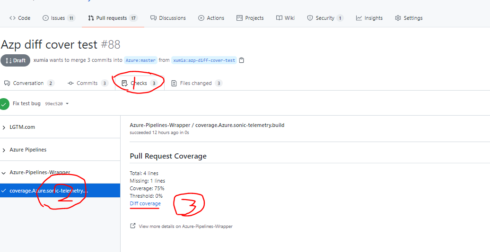
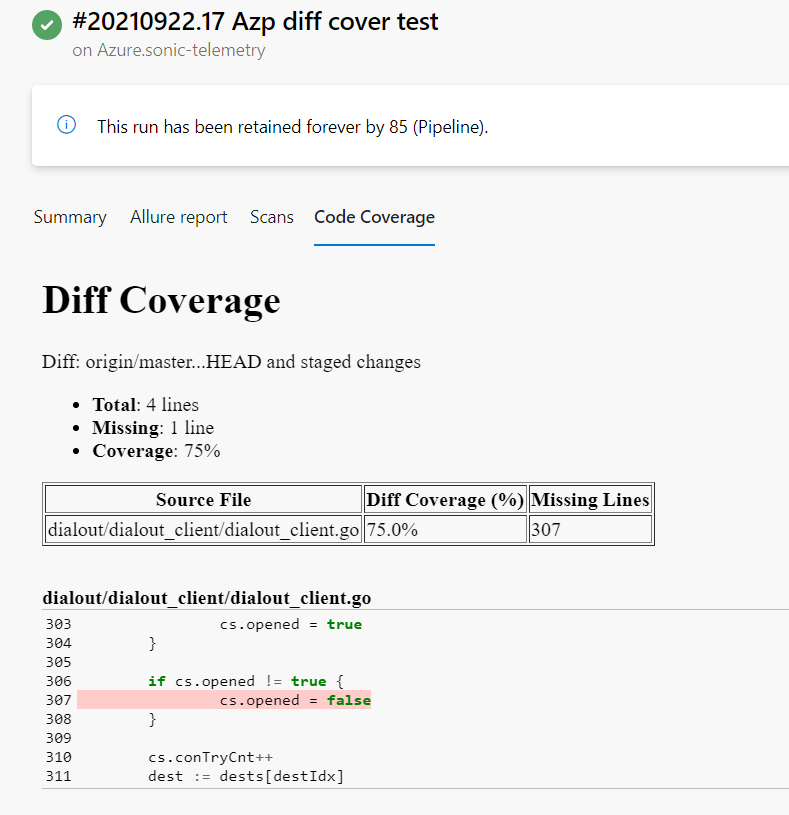

# Code Diff Coverage

## Summary:

The PR coverage is one of the important metric to measure the code quality of a repo. The Code Diff Coverage is designed for the PR owners, reviewers and component owners, to view the PR coverage report, and control the coverage. It is only a workaround, before the Azure DevOps can fully support it.

## Features:

1. Support to display the code diff coverage html report in Azure Pipelines, it can merge multiple reports together automatically.
1. Support to add the pull request checks for Code diff coverage in GitHub.

## Prerequisites:

1. Generate the code coverage report in [Cobertura](https://cobertura.github.io/cobertura/) xml format.
1. Install the Azure DevOps extension [code diff coverage](https://marketplace.visualstudio.com/items?itemName=CodeCoverageTask.code-diff-coverage) in your organization, it has been installed in mssonic.
1. Install the GitHub Application [Azure pipelines Wrapper](https://github.com/settings/apps/azure-pipelines-wrapper/installations) in your repositories if needs the PR checks, see , it has been installed in many SONiC repositories: sonic-telemetry, sonic-swss, sonic-utilities, etc.

## Pull Request examples:

|Language|Repository|Pull Request (in review)|Pull Request (test only)|
| :- | :- | :- | :- |
|C++|Azure/sonic-sairedis|<https://github.com/Azure/sonic-sairedis/pull/934>|<https://github.com/Azure/sonic-sairedis/pull/933>|
|Python|Azure/sonic-utilities|<https://github.com/Azure/sonic-utilities/pull/1834>|<https://github.com/Azure/sonic-utilities/pull/1834>|
|Go|Azure/sonic-telemetry|<https://github.com/Azure/sonic-telemetry/pull/87>|<https://github.com/Azure/sonic-telemetry/pull/88>|

## Azure Pipelines Variables:

|**Name**|**Default**|**Description**|
| :- | :- | :- |
|DIFF\_COVER\_DISABLE|true|The feature flag, not enabled by default.|
|DIFF\_COVER\_COVERAGE\_FILES|coverage.xml \*\*/coverage.xml|Relative to the diff coverage working directory, list all the coverage files in Cobertura format by space.|
|DIFF\_COVER\_COVERAGE\_REPORT\_DISABLE|false|If the value is not enabled, you can see the diff coverage report of you pull request in Azure Pipelines.|
|DIFF\_COVER\_CHECK\_DISABLE|false|It will add the checks in your pull request by default.|
|DIFF\_COVER\_CHECK\_THRESHOLD|0|The value range is 0~100. The default value is 0, always success.|
|DIFF\_COVER\_WORKING\_DIRECTORY|$(System.DefaultWorkingDirectory)|The diff coverage working directory, the default working directory used if not specified. The typical usage is for multiple repositories checked out in one job in azp. The diff coverage working directory should be in a git repository, so the diff coverage can be generated comparing the targe branch.|
The pull request check name format is "coverage.{BuildDefinitionName}.{JobName}".

## How to enable the code diff coverage feature for PR owner?

1. Enable Unit Tests in your repo and generate coverage.xml files, it can contains one coverage.xml file or multiple coverage.xml files in different directories. By default, it only search the file name exactly equal to coverage.xml in the root of the working directory and the first level directories (\*\*/coverage.xml).
1. [Option] Validate the full coverage works fine. You can send a PR to confirm the full coverage work fine in azp.
1. Add the variable DIFF\_COVER\_DISABLE=false for the jobs you want to enable the diff coverage your azp template. If you want to change the default coverage threshold, you can add the variable DIFF\_COVER\_CHECK\_THRESHOLD in the azp template as well.

Refer to the sample PRs above to enable the feature.

## How to check my PR coverage in lines?

For PR owner and reviews, you can see the uncovered lines in detail in "Code coverage" in the Azure Pipelines.

## How to enforce the PR coverage?

The PR owner can set the variable DIFF\_COVER\_CHECK\_THRESHOLD in the Azure Pipelines, if the coverage rate is less than the value you set, and the check will be failed. The check itself is not different from the other GitHub checks, we can set it as required.

